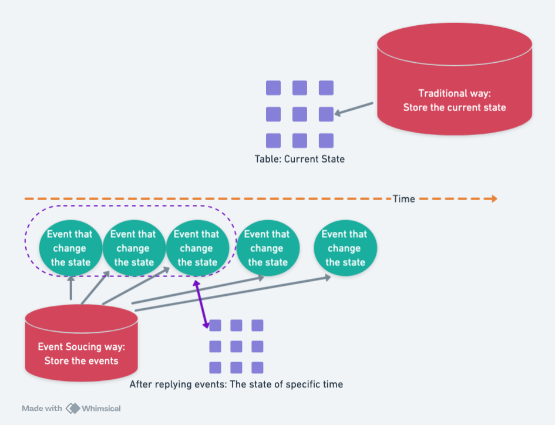

# Event Sourcing

Event sourcing is a method for **preserving application state**. Unlike traditional RDBMS databases that store only the current state of tables, event sourcing saves every event that causes a state change in the application. What is preserved, therefore, is a sequence of events.

When an application needs to determine its state at a specific point in time, it can replay these events to reconstruct the state at that moment.

## Advantages

From my perspective, event sourcing is inherently a superior approach compared to storing only the current state. To draw a simple analogy: if you were to save the source code of a plain text file, knowing the file will undergo constant modifications, how would you save it?

You’d use git, right? Event sourcing is like embedding the concept of git into a database.

Thus, it provides three significant advantages:

1. The database state can be reverted to any point in the past by replaying events.
2. Errors in the database are easier to fix since all deletions and modifications can be rolled back.
3. Synchronizing state across different nodes is highly efficient, as only updated events need to be transmitted.

## Implementation Challenges

As mentioned earlier in this series:

> A teacher who taught DDD (domain-driven design) shared similar content. After attending his course on event sourcing, participants remarked, “Teacher, event sourcing seems hard to apply in practice.”

Event sourcing is indeed challenging to implement, as there are several key difficulties to overcome:

1. You need to define a reasonable **event format** to ensure each event can fully describe the information causing the state change.
2. You must design a proper **projection method** to replay events and project the database state at a specific point in time.
3. To make database queries fast, you need to add **indexes** to the projected tables.

Fortunately, if you choose Datomic, these three design challenges can be ignored. Datomic has already solved them; all you need to do is follow its design or call its APIs.
