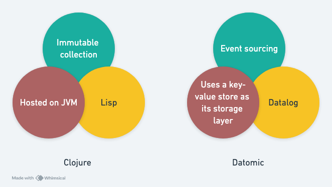

# The Database Category of Datomic

Several years ago, Martin Fowler wrote a book, *NoSQL Distilled*, which categorized NoSQL databases into four types:

1. Key-Value Databases  
2. Document Databases  
3. Column-Family Databases  
4. Graph Databases  

Perhaps due to this book's influence on the industry, whenever I discuss Datomic, I am frequently asked, "What category of database is Datomic?" I imagine my friends expect a specific category, allowing them to form a quick understanding of Datomic.

However, my answer is: **"It belongs to its own category, which I would call the 'Clojure-Datalog Database.'"**

This answer stems from two reasons:

1. After Datomic's release, its innovative design inspired the creation of at least five other databases that have **learned from** Datomic's approach. Since it is no longer unique but part of a small group, it can reasonably be considered its own category. (Note 1)  
   - DataScript  
   - Datalevin  
   - Datahike  
   - Asami  
   - XTDB  

2. Given that I regard it as a new category, what should this category be named? This is a question of taxonomy. In database naming conventions, it is common to use the query language to define the category. Hence, calling it a **Clojure-Datalog Database** seems quite appropriate.

## The Clojure Language

Upon seeing the category name, readers might wonder, "Clojure? Isn't that a programming language? What does it have to do with Datomic?"

Datomic is developed using the Clojure programming language, but the relationship between Datomic and Clojure is extraordinary. The diagram below provides an analogy to illustrate their close connection:

Both Clojure and Datomic were invented by Rich Hickey, whose unique perspective on programming has shaped their designs:

1. **At the interface level:** Rich Hickey values flexibility and expressive power. In programming languages, this led him to choose Lisp syntax; in databases, it led him to adopt the Datalog query language.

2. **For simplicity, comprehensibility, and ease of debugging:** He believes **functional programming** is essential. Consequently, in the programming language, he implemented immutable collections, while in the database, he implemented event sourcing.

3. **To ensure innovation aligns with commercial viability:** Hickey adheres to the philosophy of "Don't reinvent the wheel; integrate with existing ecosystems." In the programming language, he parasitized the JVM ecosystem, allowing Clojure to compile into Java bytecode and interoperate seamlessly with the JVM. In the database, he designed Datomic to use a variety of key-value stores for its storage layer. (Note 2)

### Notes

1. See [Clojurelog](http://clojurelog.github.io).  
2. Datomic supports storage layers such as DynamoDB, Infinispan, Riak, Couchbase, and many SQL databases.
