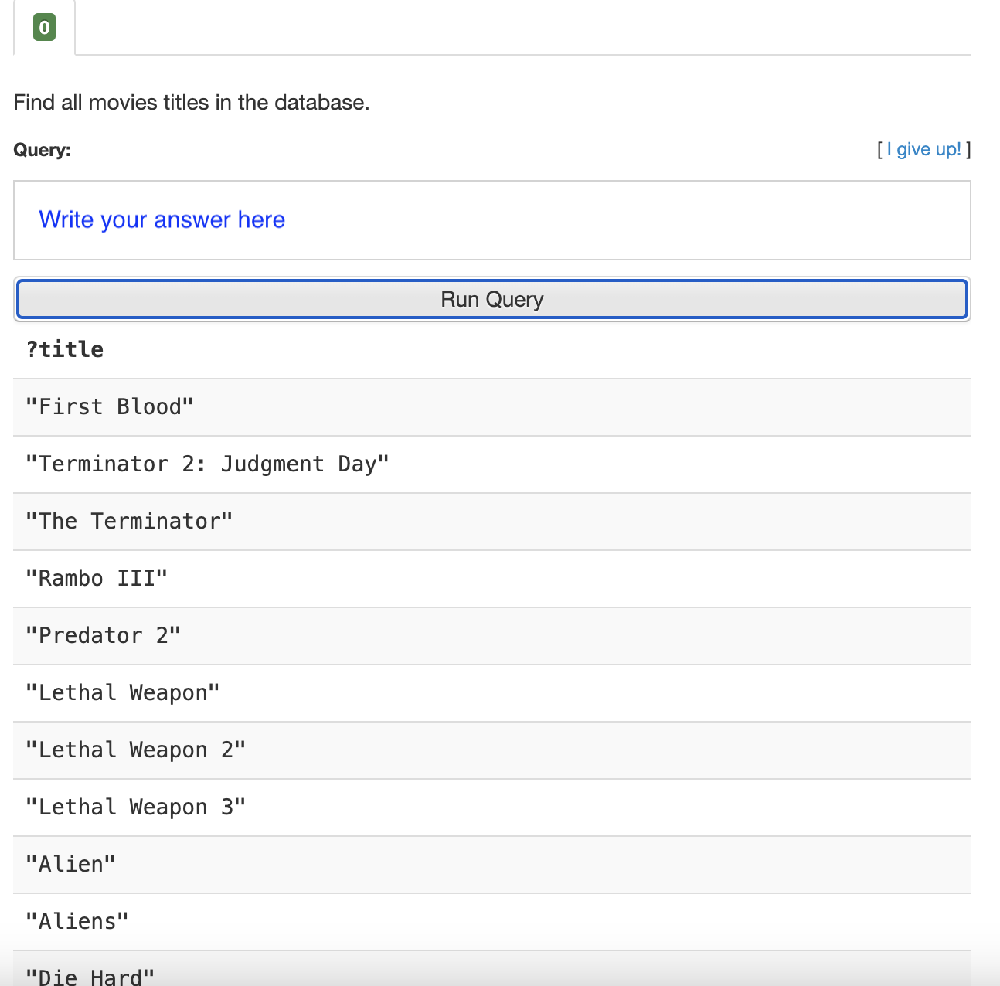
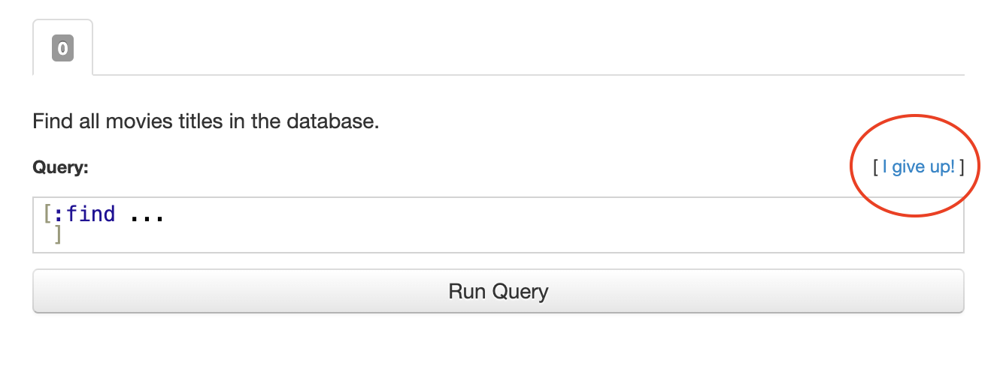

# Starting with Datalog — Part 1

Readers with some experience in databases might think:  
"Databases involve so many details; why not start by looking at the Datalog query language? If it seems unreasonable or overly complex, is it even worth spending time on?"

Datalog is a highly consistent and easy-to-learn query language. Let's dive in and experience it firsthand.

## Learn Datalog Today

**Learn Datalog Today** is an interactive, free, and registration-free Datalog tutorial website. It allows learners to solve problems and check answers interactively, providing a hands-on way to grasp the basics of the Datalog query language. Readers can visit the website and try tackling the challenges.

Here, I'll guide you through the website quickly. (Note 1)

### EDN Format (Extensible Data Notation)

The first lesson on the website introduces the EDN format.

Datomic’s Datalog uses EDN format for queries. Unlike SQL, which is a **string-based query language**, Datalog in EDN is a **data structure-based query language**.

What is EDN format? Simply put, you can think of it as an enhanced version of JSON. The notable enhancements include:

1. JSON has only two container types: objects (maps) and arrays (lists). EDN has four: maps, vectors, lists, and sets.  
2. In JSON, object keys are plain strings, whereas in EDN, the most commonly used key type in maps is the **keyword data type**. (Note 2)  
3. JSON lacks a dedicated data type for representing timestamps. EDN, however, provides a human-readable timestamp format, such as `#inst "2013-02-26"`.

That's enough about EDN for now; you can learn Datalog without diving too deeply into EDN details.

Here’s an example of a real Datalog query to illustrate EDN format:

```clojure
[:find ?title
 :where 
 [_ :movie/title ?title]]
```

In this example:

1. `:find` and `:movie/title` are keywords.
1. `?title` is a symbol.
1. `[_ :movie/title ?title]` is a vector container.

This query is "almost" equivalent to the following SQL query:

```
SELECT title
FROM movie_table;
```

### Start Solving Problems on the Website Now!

- To solve problems, write your answer in the **Query** box and click the `Run Query` button to check your answer.  
  

- If your answer is correct, the top-left corner will turn green.

- If you’re stuck, you can click the **I give up!** button (circled in red in the image) on the right to view the solution.  
  

---

### Notes:

1. [Learn Datalog Today](https://www.learndatalogtoday.org/)  
2. Many programming languages lack a keyword data type, so let me explain further:  

   In JSON, an object might look like this:  

   ```json
   {
     "name": "John",
     "age": 15
   }
   ```

   The equivalent structure in EDN would be:
   
   ```
   {
     :name: "John"
     :age: 15
   }
   ```

   Here, `:name` and `:age` are keywords. Using a dedicated keyword data type to represent object/map keys improves semantic clarity.
