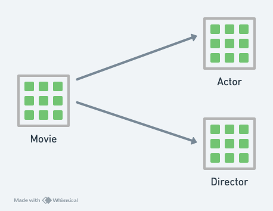

# Starting with Datalog - Part 2

In Part 1, an example of a Datalog query was provided:

```
[:find ?title
 :where 
 [_ :movie/title ?title]]
```

Here, `:find` has a meaning similar to SQL’s `SELECT`, as both specify the query's target and define output refinements.

The real difference lies in `:where`. While SQL also uses `WHERE` for specifying row filtering conditions, there are two key differences in Datalog:

1. Datalog does not use SQL's `FROM` to specify tables.
2. The syntax of conditions in Datalog's `:where` looks significantly different from SQL.

To explain these differences, we need to understand **Datomic's information model**.

## Datomic's Information Model

When imagining the information model of an SQL database, it usually looks something like this:

- Each table can be seen as a **set**.
- Each set contains numerous **entities**, stored in rows.
- Relationships can exist between different sets.



Datomic's information model, however, is radically different. Imagine the entire database as if it had just one table with five columns:

```
[<entity-id>  <attribute>      <value>          <tx-id>  <op>]
...
[ 167    :person/name     "James Cameron"    102  true]
[ 234    :movie/title     "Die Hard"         102  true]
[ 234    :movie/year      1987               102  true]
[ 235    :movie/title     "Terminator"       102  true]
[ 235    :movie/director  167                102  true]
...
```

Each row in this table is called a **datom**.

The five columns are as follows:

- **Entity ID** (entity-id)
- **Attribute** (attribute)
- **Value** (value)
- **Transaction ID** (tx-id)
- **Operation** (op)

### Understanding This Special Information Model

To understand this, imagine converting multiple SQL tables into a single Datomic table. Here’s how this could be done:

1. Define the Datomic table schema with three main columns: `entity-id`, `attribute`, and `value` (shortened to the **EAV model**). 
   - `entity-id`: Long integer.
   - `attribute`: String.
   - `value`: Binary (BLOB).
2. Add a unique column to each SQL table to serve as the global row identifier, which maps to `entity-id`.
3. Prepend table names to column names (e.g., `title` in the `movie` table becomes `:movie/title`).
4. Transform each row from every table into EAV format and insert it into the Datomic table.

Example transformation:

```
movie table 

[entity-id  :movie/title   :movie/year   :movie/director]
...
[214748   "Terminator"   1987   "James Francis Cameron"]
```

becomes:

```
Datomic table 

[<entity-id>   <attribute>      <value>]
...
[214748   :movie/title   "Terminator"]
[214748   :movie/year   1987]
[214748   :movie/director   "James Francis Cameron"]
```

If you're thinking this approach is interesting and wondering if a similar schema could be used for SQL databases: this is known as the **EAV model** and is often considered an **anti-pattern**. However, some real-world applications, like WordPress's `user meta` and `post meta` tables, still use this model.

Datomic's information model is slightly more complex than the EAV model due to the addition of **transaction IDs** and **operations**:

- **Transaction ID (tx-id)**
  - Datoms are written into the database at different times, and their write timestamps are recorded as special transaction datoms. `tx-id` points to these transaction datoms. Since transaction IDs increase over time, they indicate the relative order of datoms' creation.
- **Operation (op)**
  - This column has two values: `true` or `false`.
  - `true` means the datom's fact **exists**; `false` means it **does not exist**. Deleting a fact involves writing new datoms where the operation is set to `false`.

## Basic Datalog Queries

The following query retrieves all entities with `:person/name` equal to `"Ridley Scott"`:

```
[:find ?e
 :where
 [?e :person/name "Ridley Scott"]]
```

Explanation:

1. `[?e :person/name "Ridley Scott"]` matches this condition against the database's content. Here, `?e` in the `:where` clause is a variable.
2. Returns all matching `?e` values.

Doesn’t it resemble an SQL query? The part executed first appears lower in the query.

### Exercises

- [ ] Try the [Basic Queries](https://www.learndatalogtoday.org/chapter/1)!
