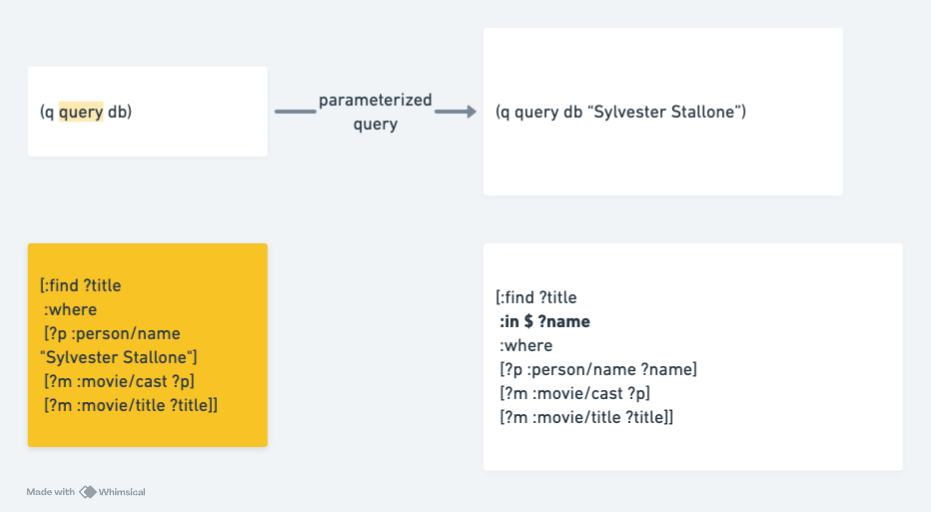

# Starting with Datalog - Part 4

When working with SQL databases, we sometimes use parameterized queries, for example, to prevent SQL injection. Below is an example using PostgreSQL:

* **Prepare SQL Statement**

```
PREPARE get_users_by_age(int) AS
SELECT id, name FROM users WHERE age = $1;
```

* **Execute Query**

```
EXECUTE get_users_by_age(30);
```

## Parameterized Queries in Datalog

The following query retrieves "all movie titles featuring the actor Sylvester Stallone":

```
[:find ?title
 :where
 [?p :person/name "Sylvester Stallone"]
 [?m :movie/cast ?p]
 [?m :movie/title ?title]]
```

But what if we want to query "all movies featuring other actors"? This can be achieved using parameterized queries. Parameterized queries in Datalog primarily rely on the `:in` clause.

```
[:find ?title
 :in $ ?name
 :where
 [?p :person/name ?name]
 [?m :movie/cast ?p]
 [?m :movie/title ?title]]
```

Notice that the parameterized query differs from the original query in two key ways:

- A new clause `:in $ ?name` has been added. Here, `$` corresponds to the **database value**, while `?name` corresponds to the actor's name as a parameter.
- The pattern `[?p :person/name "Sylvester Stallone"]` has been modified to `[?p :person/name ?name]`.

The Datomic database provides a function `datomic.api/q` specifically for processing queries. This function also accepts parameter values.

For the simplest queries, the function call takes the form `(q query db)`, where `query` is the query and `db` is the database value. In such cases, the `:in` clause defaults to `:in $` and can be omitted entirely.

For parameterized queries, as in the example above, the function call would look like `(q query db "Sylvester Stallone")`. Here:

- `query` is the parameterized query.
- `db` is the database value, corresponding to `$`.
- `"Sylvester Stallone"` is the actor's name, corresponding to the `?name` parameter.



### Database Values and `$`

“Wait, does the `$` for the database value really matter?”

In fact, a complete data pattern has five elements. The first element corresponds to the database value, though in many cases it can be omitted for simplicity.

```
[<database> <entity-id> <attribute> <value> <transaction-id>]
```

In other words, the earlier parameterized query can also explicitly include `$` at the beginning of each data pattern, like so:

```
[:find ?title
 :in $ ?name
 :where
 [$ ?p :person/name ?name]
 [$ ?m :movie/cast ?p]
 [$ ?m :movie/title ?title]]
```

The results of the query will remain the same.
