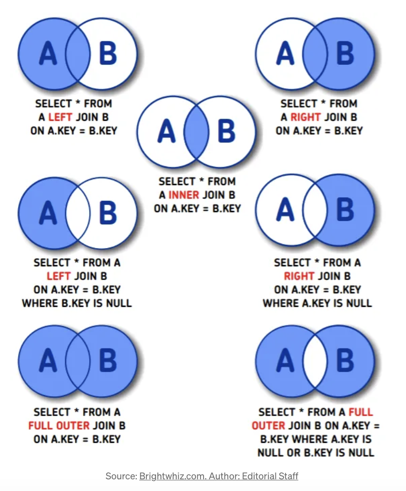

# Starting with Datalog -- Part 7 (More Joins)

Readers familiar with SQL likely know there are many types of joins. However, claiming there are "7 different types of joins in SQL" might be an exaggeration. By observing the diagram below, you’ll notice that `left join` and `right join` are symmetric, as are `left join ... is null` and `right join ... is null`. This symmetry lets us immediately eliminate two types of joins.



By further simplifying, we can reduce the necessary SQL syntax to three basic constructs, which are sufficient to derive results for all 7 types of joins:

1. `inner join`
2. `left join ... is null`
3. Combining multiple query results

## Using Datalog to Perform Various SQL Joins

In article [Day8](./day08.md), we established that standard Datalog syntax can already perform an `inner join`. In other words, to achieve SQL join results using Datalog, we only need to find corresponding syntax for `left join ... is null` and combining multiple query results (union).

### `left join ... is null`

Suppose we want to use SQL to query "actors who exist in the `person` table but have no roles in the `movie` table." This can be written as:

```
SELECT person.name
FROM person
LEFT JOIN movie
ON person.id = movie.cast
WHERE movie.cast IS NULL;
```

We can rewrite this using an equivalent SQL expression:

```
SELECT person.name
FROM person
WHERE NOT EXISTS (
    SELECT 1 
    FROM movie 
    WHERE movie.cast = person.id
);
```

In Datalog, this can be expressed using the `not` or `not-join` clause (Note 1):

```
[:find ?name
 :where
 [?p :person/name ?name]
 (not [?m :movie/cast ?p])]
```

Do you notice that SQL and Datalog have a similar syntax? On closer inspection, Datalog exhibits greater consistency.

### Union

Suppose we want to use SQL to query "the union of all people’s names and all movie titles." This can be written as:

```
SELECT name FROM person
UNION
SELECT title AS name FROM movie;
```

In Datalog, this can be expressed using the `or` or `or-join` clause (Note 2):

```
[:find ?name
 :where
 (or
   [?p :person/name ?name]
   [?m :movie/title ?name])]
```

### An Alternative to `left join`

Following the above logic, the most intuitive way to emulate a `left join` would be:

1. Perform an `inner join`
2. Derive `left join ... is null`
3. Combine the two results

However, this complexity is unnecessary. A more straightforward approach uses Datalog’s `pull` query (Note 3).

For example, the query below first retrieves all people, then uses `pull` to check if any movies cast them as actors:

```
[:find [(pull ?e [:person/name 
                  :movie/_cast]) ...]
 :where 
 [?e :person/name]]
```

Notes:

1. [Datalog Query Syntax: `not` Clause](https://docs.datomic.com/query/query-data-reference.html#not-clauses)
2. [Datalog Query Syntax: `or` Clause](https://docs.datomic.com/query/query-data-reference.html#or-clauses)
3. [Datalog Does Not Require `left join` Syntax](https://github.com/Datomic/day-of-datomic/blob/daa457f766e16f55243a95513e759573b8827329/tutorial/social_news.clj#L105)
