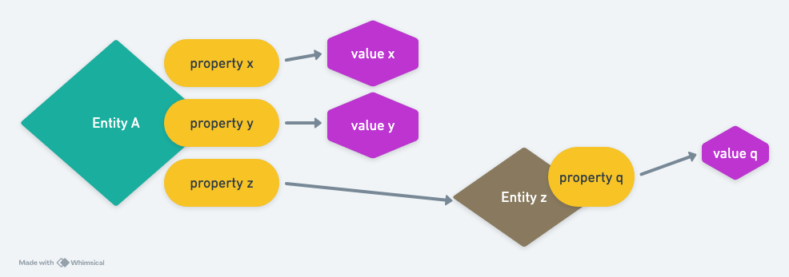

# Pull API

Readers may have heard of graph query languages like GraphQL and perhaps even used GraphQL before. If you enjoy the graph semantics provided by GraphQL, you’ll likely find Datomic’s Pull API familiar and intriguing.

Here’s an example: *“Find the group name of Led Zeppelin and the year they started”*

```
(d/pull db
        '[:artist/name :artist/startYear]
        led-zeppelin)

;; Result
;; =>  #:artist{:name "Led Zeppelin", :startYear 1968}
```

This is using Datomic's Pull API, which has three input arguments:

1. `db`: The data source variable, usually pointing to a database.
2. `'[:artist/name :artist/startYear]`: The pattern.
3. `led-zeppelin`: The entity ID.



Assuming the database relationships look like the diagram above, if we want to retrieve *“the values of attributes x, y, and z for entity A”*:

```
(d/pull db
        '[:x :y :z]
        entity-id-A)
```

## Recursive Queries

Building on the previous example, if the value of attribute `:z` happens to be the entity ID of another entity, we can descend one level deeper in the query by modifying the pattern. For instance, replace `:z` with `{:z [:db/id :q]}`. Here, `:db/id` retrieves the entity ID of `z`.

The following query retrieves the values of `x` and `y` for `entity-id-A` and recursively fetches the `q` and `db/id` attributes of the entity referenced by `z`.

```
(d/pull db
        '[:x :y 
          {:z [:db/id :q]}]
        entity-id-A)
```

## All Attributes

Sometimes, we may want to retrieve all attributes of a specific entity. This can be done using a **wildcard pattern**.

```
;; What does led-zeppelin have?

(d/pull db '[*] led-zeppelin)

;; Result
;; => {:artist/sortName "Led Zeppelin",
       :artist/name "Led Zeppelin",
       :artist/type #:db{:id 70746976177619070, :ident :artist.type/group},
       :artist/country #:db{:id 47850746040811801, :ident :country/GB},
       :artist/gid #uuid "678d88b2-87b0-403b-b63d-5da7465aecc3",
       :artist/endDay 25,
       :artist/startYear 1968,
       :artist/endMonth 9,
       :artist/endYear 1980,
       :db/id 2458507999719892}
```

## Reverse Queries

Pull API naturally and elegantly expresses “containment” semantics. On the other hand, there are scenarios where the third argument (entity ID) is contained by other entities. In such cases, we can use an **underscore** in the attribute to express a *reverse query*, fetching the entities that contain the third argument.

Here, the `:release/_artists` attribute is derived by adding an underscore to `:release/artists`. Note that the underscore is placed to the right of the `/`.

```
(d/pull db '[* :release/_artists] led-zeppelin)

;; Result
;; => {:artist/sortName "Led Zeppelin",
       :artist/name "Led Zeppelin",
       :artist/type #:db{:id 70746976177619070, :ident :artist.type/group},
       :artist/country #:db{:id 47850746040811801, :ident :country/GB},
       :artist/gid #uuid "678d88b2-87b0-403b-b63d-5da7465aecc3",
       :artist/endDay 25,
       :artist/startYear 1968,
       :artist/endMonth 9,
       :release/_artists
       [#:db{:id 12591607161327185}   ;; ----.
        #:db{:id 13611953951903311}   ;;     | 
        #:db{:id 14614708556444205}   ;;     | 
        #:db{:id 20349761206917151}   ;;     | 
        #:db{:id 27505382880490028}   ;;     | 
        #:db{:id 30606005670815267}   ;;     | 
        #:db{:id 36437815344539172}   ;;     | 
        #:db{:id 38834750693087262}   ;;     | 
        #:db{:id 43703388180886059}   ;;     |-- Releases
        #:db{:id 43910096366902013}   ;;     | 
        #:db{:id 45994770413170389}   ;;     | 
        #:db{:id 49236130691853680}   ;;     | 
        #:db{:id 51514318784597586}   ;;     | 
        #:db{:id 54157544737773785}   ;;     | 
        #:db{:id 58683134597703205}   ;;     | 
        #:db{:id 66718365573484112}   ;;     | 
        #:db{:id 71402285107818196}], ;; ----' 
       :artist/endYear 1980,
       :db/id 2458507999719892}
```
