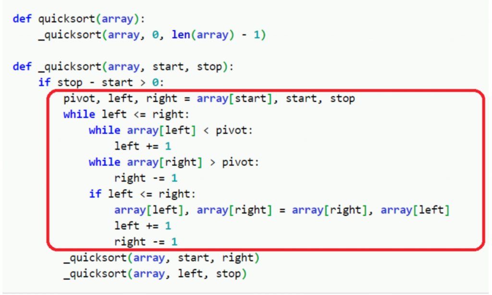
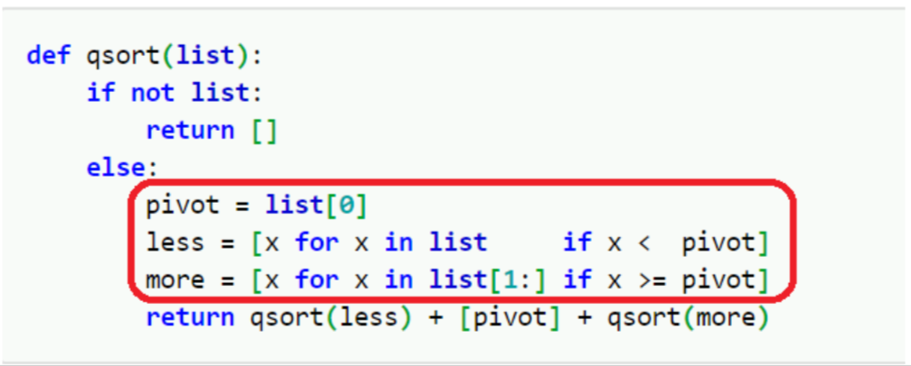

# Impedance Mismatch and Datomic's Solution

In [Day 4](./day04.md), we discussed the impedance mismatch problem and highlighted two common forms of this issue:

1. N+1 queries causing excessive I/O, slowing down performance.
2. N+1 queries potentially causing data inconsistency due to concurrent writes.

Experienced software developers know: “The challenges of distributed systems might only arise when the system scales out as it grows. However, the impedance mismatch problem often appears within the first month of starting a new project.” Thus, let's delve deeper into the impedance mismatch issue.

## Common Solutions

The industry has long developed solutions for impedance mismatch. Common approaches can be categorized into two main types:

- Abandoning relational databases and adopting document data stores.

This approach often leads to serious consistency issues as systems grow more complex. Relational databases remain mainstream largely because they provide a **single source of truth**. Conversely, document data stores, designed to align with application-side information models, tend to encourage data duplication. When updates occur, how can we ensure all replicas pointing to the same data are consistently updated?

- Using ORM (Object Relational Mapping) libraries for automatic conversion.

This approach introduces performance and inconsistency issues due to N+1 queries. Additionally, it can pose security risks, such as SQL injection.

## Analyzing the Impedance

The root cause of impedance mismatch lies in **conceptual differences between object-oriented models and relational data models**. What are these differences? For simplicity, let’s compare the key concepts across four critical aspects.

| Aspect         | Object-Oriented Model | Relational Model |
|----------------|------------------------|------------------|
| Data Structure | Dictionary, Object    | Table            |
| Traversal      | Centered around specific entities and their children/neighbors | Queries |
| Composability  | Good                  | Poor (because SQL is a string-based query language) |
| Semantics      | PLOP                  | PLOP             |

### Data Structure

On the application side, a student is typically represented as a dictionary:

```
{:name "John"
 :age 15
 :sex "Male"}
```

In a database, a student is represented as a table:

```
CREATE TABLE student (
    name VARCHAR(100),
    age INT,
    sex CHAR(1)
);
```

### Traversal

On the application side, traversal often follows a consistent pattern: starting from a specific data entity (e.g., a student) and retrieving all related entities or attributes. Common statements include:

```
- get attributes of a
- get direct links of a
```

In databases, everything is retrieved through SQL queries, requiring explicit description of joins and join keys.

### Composability

SQL, being a string-based query language, has poor composability. Many ORMs accept inputs in general programming languages, automatically recompose them into SQL queries. However, this transformation is challenging to get right. ORM libraries are prone to security issues, such as SQL injection.

One might ask: “Is this related to SQL being string-based?”

The core issue lies in its string nature. A well-designed query language should be based on structured data types, as discussed in [Day 3](./day03.md). When the query language aligns with data structures, it becomes easier to decompose queries into components while ensuring consistency in the syntax tree during decomposition and reconstruction.

> Explaining SQL injection in Mandarin:
>
> Imagine someone asks you to create a sentence starting with “if”. (“if” in Mandarin is "如果"). This request assumes a syntax tree like:
>
> **“如果” + “clause 1” + “,” + “clause 2”**
>
> **“if” + “clause 1” + “,” + “clause 2”**
>
> You respond with: 『牛奶不如果汁好喝』。That sentence means “Milk **is worse than** juice.”
>
> Although the answer still contains the "如果", but its syntax tree lacks “if”...

### Semantics

PLOP semantics can be abstract, so let’s use a practical example.

Below are two Python implementations of `qsort`, one using imperative programming and the other functional programming, sourced from [Rosetta Code](https://rosettacode.org/).

- **Imperative Programming**  
  

- **Functional Programming**  
  

The highlighted sections perform the equivalent operation: **partitioning an array** by placing elements smaller than a pivot `p` before it and elements larger after it. Partitioning is a complete conceptual operation requiring holistic consideration.

The functional example uses newly allocated memory (`less` and `more`) to store results, simplifying implementation compared to the imperative example. Why is the imperative example more complex? It handles two tasks simultaneously:

1. Array partitioning.
2. Memory optimization (partitioning in-place).

Rich Hickey, the creator of Clojure, coined the term **place-oriented programming (PLOP)** for the first style. The second style can be termed **value-oriented programming (VOP)**. For humans, programming with “values” is far simpler than with “places.”

Both the object-oriented and relational models follow the PLOP paradigm. In PLOP, when a variable `A` is updated at time `t1`, all entities containing `A` only reflect `A`’s new value after `t1`, losing access to its prior states.

## Datomic's Solution

Datomic ostensibly solves impedance mismatch with its **Pull API** and **Datalog queries**.

Datomic users may not overthink these features and find them intuitive, avoiding N+1 I/O issues, data inconsistencies, or security risks. Let’s analyze why this feels natural.

### Data Structure and Traversal

| Datomic API    | Pull API             | Datalog Query |
|----------------|----------------------|---------------|
| Data Structure | Dictionary           | Table         |
| Traversal      | Entity-centered      | Query         |

### Composability

Datomic uses a structured query language, eliminating SQL injection risks.

### Semantics

Datomic implements **event sourcing** internally. Instead of in-place updates, every write is recorded as an **event**. Thus, Datomic embodies **value-oriented programming (VOP)** semantics.

VOP ensures consistency. For Datomic, the database corresponds to different values at different points in time. Knowing a timestamp allows precise access to the corresponding database value, akin to Git.

## References

- [The Impedance Mismatch is Our Fault](https://www.infoq.com/presentations/Impedance-Mismatch/)
