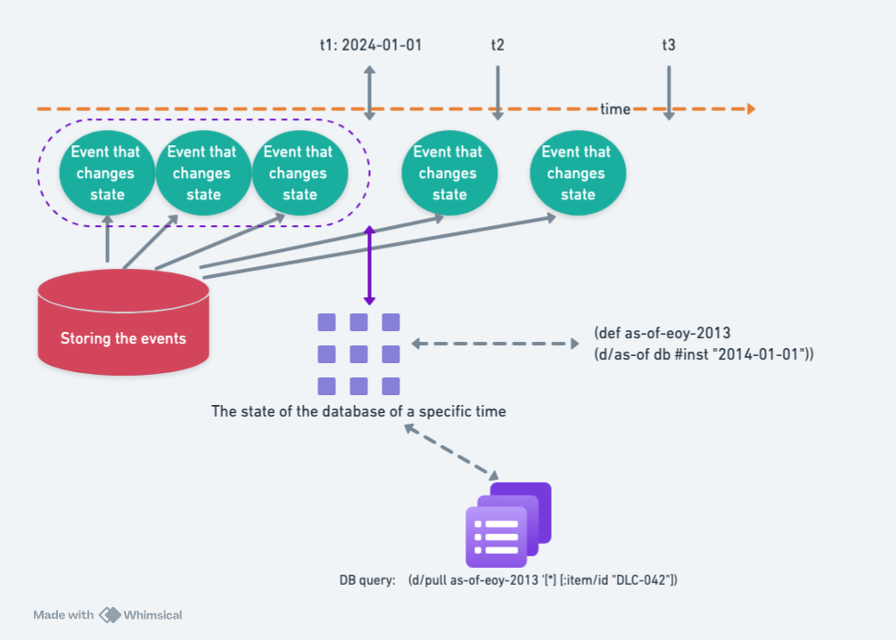

# as-of Query



Let's start by explaining the diagram:

- The green circles represent "events that change the database state," which are individual data atoms (datoms). Datoms record real-world information in the form of `E/A/V/T/op`.
- The purple nine-square block represents the database corresponding to `t1`, which is the aggregation of all datoms **before** time `t1`.

Time `t1` corresponds to `2024-01-01`, and the current time is `t3`. At `t3`, is it possible to query the database to retrieve the state of the database as of `t1`? In an RDBMS, this would be quite troublesome; in Datomic, which is designed based on event sourcing, this can be easily achieved using the `d/as-of` API.

## Code and Data Examples

* Green circle section

| e                    | a                  | v                         | tx           | added |
|----------------------|--------------------|---------------------------|--------------|-------|
| 0x00000c00000003e9    | :db/txInstant      | Mon Dec 31 19:00:00        | 0xc00000003e9| true  |
| 0x00001000000003ea    | :item/id           | DLC-042                    | 0xc00000003e9| true  |
| 0x00001000000003ea    | :item/description  | Dilitihium Crystals        | 0xc00000003e9| true  |
| 0x00001000000003ea    | :item/count        | 100                        | 0xc00000003e9| true  |
| 0x00000c00000003eb    | :db/txInstant      | Thu Jan 31 19:00:00        | 0xc00000003eb| true  |
| 0x00001000000003ea    | :item/count        | 100                        | 0xc00000003eb| false |
| 0x00001000000003ea    | :item/count        | 250                        | 0xc00000003eb| true  |
| 0x00000c00000003ec    | :db/txInstant      | Thu Feb 27 19:00:00        | 0xc00000003ec| true  |
| 0x00001000000003ea    | :item/count        | 250                        | 0xc00000003ec| false |
| 0x00001000000003ea    | :item/count        | 50                         | 0xc00000003ec| true  |
| 0x00000c00000003ed    | :db/txInstant      | Mon Mar 31 20:00:00        | 0xc00000003ed| true  |
| 0x00000c00000003ed    | :tx/error          | true                       | 0xc00000003ed| true  |
| 0x00001000000003ea    | :item/count        | 50                         | 0xc00000003ed| false |
| 0x00001000000003ea    | :item/count        | 9999                       | 0xc00000003ed| true  |
| 0x00000c00000003ee    | :db/txInstant      | Wed May 14 20:00:00        | 0xc00000003ee| true  |
| 0x00001000000003ea    | :item/count        | 9999                       | 0xc00000003ee| false |
| 0x00001000000003ea    | :item/count        | 100                        | 0xc00000003ee| true  |

* Query at current time `t3`

```
(def db (d/db conn))
(d/pull db '[*] [:item/id "DLC-042"])
=> {:db/id 55301036830621764, 
     :item/id "DLC-042", 
     :item/description "Dilitihium Crystals", 
     :item/count 100}
```

* Query after going back to `t1`

```
;; Note: db is the database corresponding to time t3.
;; (d/as-of db t1) returns the database corresponding to time t1.

(def as-of-eoy-2013 (d/as-of db #inst "2014-01-01"))
(d/pull as-of-eoy-2013 '[*] [:item/id "DLC-042"])
=> {:db/id 55301036830621764, 
      :item/id "DLC-042", 
      :item/description "Dilitihium Crystals", 
      :item/count 250}
```

## Database Filters

Here we clarify the ambiguity in the term "database":

1. The first meaning is the general one we often use, e.g., RDBMS database or Datomic database. It may refer to an abstract concept or software that stores all the data.
2. The second meaning is specific to the Datomic worldview. It refers to the result of aggregating datoms. In Datomic, data exists in the form of datoms. All the data in Datomic is a sequence of datoms. However, datoms cannot be queried directly—they must first be **aggregated** into a 'database' before they can be queried.

When we talk about "database filters," the database refers to the second meaning. Datomic provides three built-in database filters:

- `as-of`: Filters for all datoms **before** a specific time.
- `since`: Filters for all datoms **after** a specific time.
- `history`: Makes the database include **non-aggregated** datoms, particularly those with `added` set to `false`. This allows us to view all modifications to a specific entity.

## References

- [Database Filter](https://docs.datomic.com/reference/filters.html)
