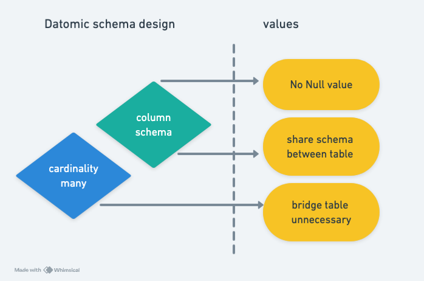

# Column Schema

Datomic's schema is much more flexible than SQL databases. Here, we explore its flexibility from three perspectives:



1. No need for `NULL` values  
2. Shared column schema  
3. No need for bridge tables  

## No Need for `NULL` Values

If a table `people` has three data entities representing basic personal information, and only one person has a job:

```
{:name "John"
 :age 55
 :sex "Male"
 :job "Engineer"}

{:name "Mary"
 :age 45
 :sex "Female"}

{:name "Jack"
 :age 20
 :sex "Male"}
```

In SQL databases, because the table's columns are fixed, there are two options to record such data:

1. Define four columns in the `people` table and let the `job` column for Mary and Jack have `NULL` values.  
2. Define only three columns (`name`, `age`, `sex`) in the `people` table and create a separate `job` table with a column pointing to the `people` table. Accessing data later would require a `join`.  

In Datomic, the smallest schema unit is not a table but a column, known as an **attribute**. For this example, Datomic's column schema can be defined as follows:

```
(def schema
  [{:db/ident       :people/name
    :db/valueType   :db.type/string
    :db/cardinality :db.cardinality/one}

   {:db/ident       :people/age
    :db/valueType   :db.type/long
    :db/cardinality :db.cardinality/one}

   {:db/ident       :people/sex
    :db/valueType   :db.type/long
    :db/cardinality :db.cardinality/one}
    
   {:db/ident       :people/job
    :db/valueType   :db.type/string
    :db/cardinality :db.cardinality/one}])
```

In Datomic, data entities can be imagined as dictionary structures in a programming language. If a specific column is missing, the attribute simply doesn't exist, and there is no need for `NULL` values.

## Shared Column Schema

If we define a Datomic attribute (i.e., column schema) representing the start time of a data entity, it can be defined as:

```
{:db/ident       :time/start
 :db/valueType   :db.type/instant
 :db/cardinality :db.cardinality/one}
```

This column schema can be applied to the `people` table to represent a person's birthdate, or to the `car` table to represent the purchase date of a car. Once this is done, we can retrieve all data entities earlier than a specific date using the following Datalog query, regardless of whether they are people or cars:

```
[:find ?e
 :in $ ?date
 :where [?e :time/start ?t]
        [(< ?t ?date)]
```

## No Need for Bridge Tables

In SQL databases, when modeling many-to-many relationships, we often need to design a bridge table.

In Datomic, this is unnecessary because we can set `:db/cardinality` to `:db.cardinality/many`, which allows a column schema to represent a "one-to-many" relationship. For readers familiar with graph databases like Neo4j, you can think of Datomic as allowing you to define "edges."
