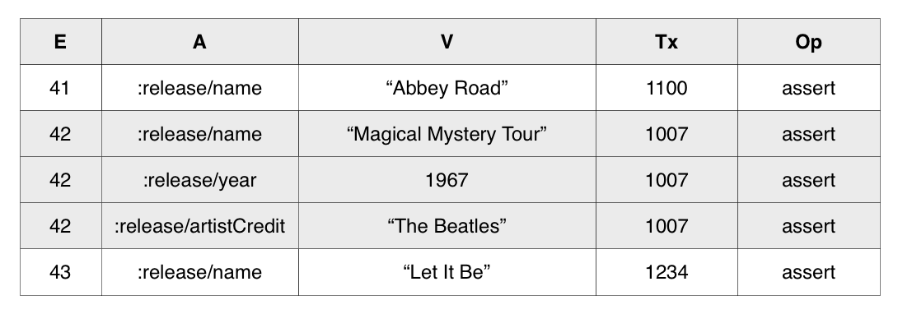
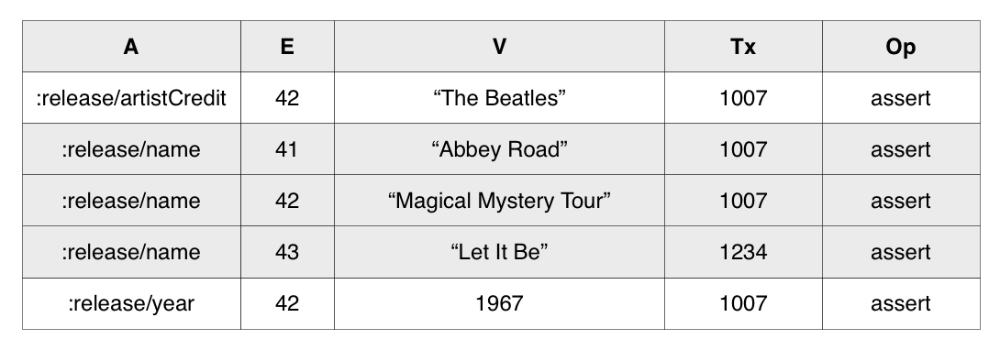
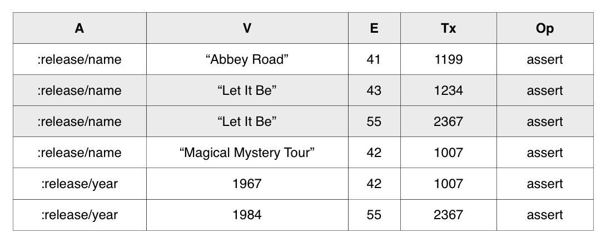

# Indexes and Performance

Previously, in [Day25](./day25.md), we discussed primary key settings and mentioned that Datomic can be seen as a high-level database. It allows users to focus on business rules without worrying about primary key design.

Regarding indexes, Datomic similarly provides high-level semantics. There are four types of indexes in Datomic, three of which are generated automatically. Only the AVET index requires manual configuration by setting `:db/index` in the schema.

The four types of indexes are:

1. EAVT  
2. AEVT  
3. AVET  
4. VAET  

Among them, EAVT and AEVT include all datoms in the database. AVET only contains datoms where the schema has `:db/index true`. VAET includes datoms where the schema’s value type is `:db.type/ref` and is used for reverse queries.

For example, the following schema for the `:order/customer-id` attribute would generate an AVET index, which is closest in semantics to traditional SQL database indexes.

```
{:db/ident :order/customer-id
 :db/valueType :db.type/uuid
 :db/index true
 :db/cardinality :db.cardinality/one}
```

## Internal Structure of Indexes

- **EAVT** provides an efficient index starting with entity IDs. It is equivalent to row access style in SQL.



- **AEVT** provides an efficient index starting with attributes. It is equivalent to column access style in SQL.



- **AVET** is the most expensive index to maintain among the four types. Therefore, it is not generated automatically. It must be explicitly enabled by setting `:db/index true`.



- **VAET** is suitable for reverse queries. Upon closer examination, the corresponding values (V) in this index are all entity IDs, naturally satisfying primary key characteristics: uniqueness and non-nullability. As a result, this index is also generated automatically, and its maintenance cost is relatively low.


