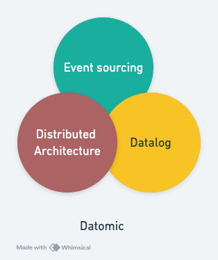
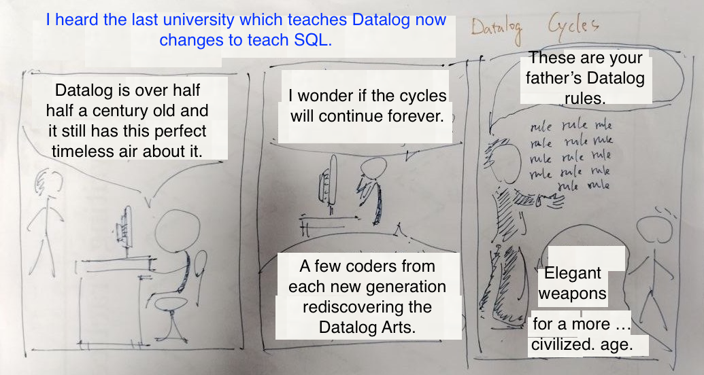

# The Business Value of Datomic: A New Database Paradigm

Referencing the image above, we will explore the value Datomic brings from three different perspectives.

## Event Sourcing

Datomic's event sourcing model treats every **transaction as an immutable event**, providing significant value to various business applications.

### Reversible Transactions

In traditional databases, data changes are typically irreversible; once an update is executed, the old data is overwritten. However, in Datomic’s model, each transaction only adds new events, allowing past database states to be revisited and restored. This reversibility enables quick corrections of machine or human errors, a feature of profound significance in industries like manufacturing and finance, where high reliability is critical.

### Auditable Transactions

Datomic supports transaction queries, making it easy to audit every transaction. This functionality is not only valuable for regulatory compliance but also helps businesses analyze past data changes to identify potential issues and trends. For example, in finance, audit trails can trace the data entities affected by a transaction and perform recursive queries to identify all related entities, effectively matching fraud patterns.

### Time Travel Queries

Datomic’s time travel query feature allows businesses to look back at any point in time using `as-of` queries to view the database state at that specific moment. This functionality is invaluable for new feature testing, debugging complex issues, and managing product life cycles.

## Highly Expressive Query Language

Datalog offers querying capabilities at least equivalent to SQL, as discussed thoroughly from Day 6 to Day 19. Beyond this, Datalog's **intuitive syntax** has great potential to enhance business productivity.

### Rules and Recursive Queries

Thanks to its support for rules and recursive queries, Datalog excels in representing hierarchical relationships, such as hardware product part trees or social networks. It effortlessly traverses hierarchical data, enabling businesses to uncover critical insights quickly.

### Natural Language to Datalog Conversion

Technologies that convert natural language queries from non-technical users into SQL queries allow employees across different levels to obtain answers from the database through simple interactions, enhancing decision-making and productivity. With advancements in large language models (LLMs), the accuracy of such conversions has significantly improved, although there is still room for further quality improvements.

On the other hand, converting natural language queries into Datalog queries is much simpler due to Datalog’s syntax being closer to natural language. This reduction in complexity makes large-scale usage feasible.

## Unique Distributed Architecture

Datomic’s unique distributed architecture preserves essential database transaction properties (ACID) while enabling horizontally scalable reads. This architecture impacts two key areas: enhancing developer productivity and providing high availability and scalable performance.

### Deploy-Free Custom Query Functions

In Datomic, the complete separation of reads and writes means query execution happens in the backend program. Consequently, custom query functions can run without being deployed into the database. This deploy-free characteristic simplifies query language syntax and accelerates development.

### Replaceable Key-Value Stores (Key-Value Store Performance Bonus)

Datomic leverages existing key-value storage technologies (e.g., DynamoDB, Cassandra) to provide highly available and horizontally scalable data storage solutions.

Furthermore, if more efficient key-value storage technologies emerge in the future, Datomic’s software can be easily adapted with minimal modifications. This adaptability means Datomic doesn’t need to invest heavily in developing storage technologies but can still benefit from advancements in key-value storage performance. (Similarly, Clojure, running on the JVM, enjoys performance improvements brought by JVM advancements.)

## Conclusion

By ingeniously combining event sourcing, a highly expressive Datalog query language, and a unique distributed architecture, Datomic delivers features like reversible transactions, auditable transactions, time travel queries, powerful hierarchical data querying, natural language-like queries, deploy-free custom query functions, and long-term key-value store performance bonuses. In summary, Datomic provides a **fault-tolerant, flexible, developer-friendly, and scalable database solution**, making it a paradigm for next-generation databases.

* The image above is a parody of xkcd's classic comic [Lisp Cycles](https://www.explainxkcd.com/wiki/index.php/297:_Lisp_Cycles), adapted for Datalog. The message remains unchanged: *“Elegant designs have the opportunity to be rediscovered in every generation.”*
